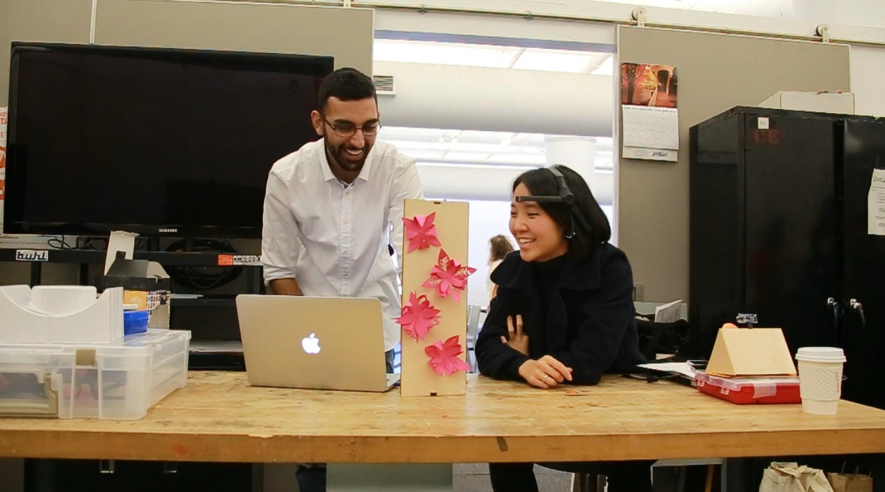
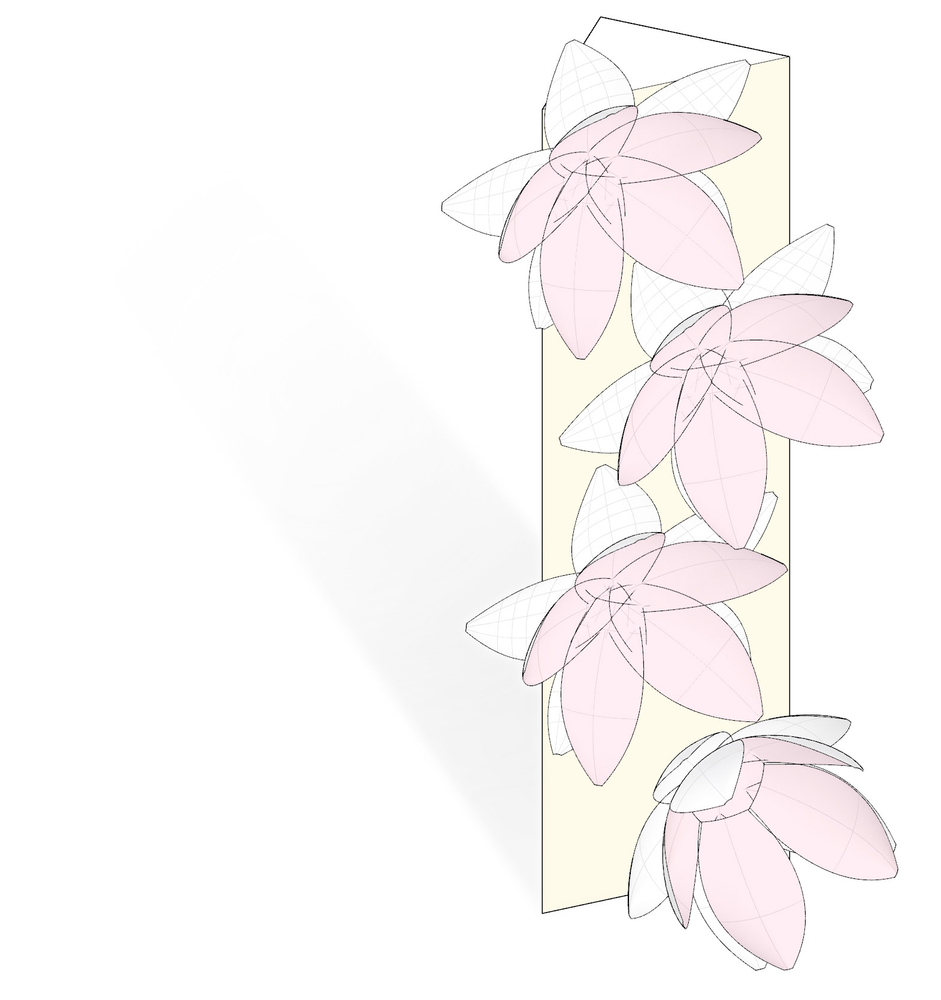
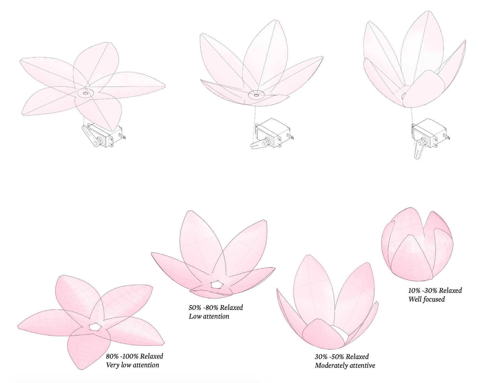

Cognitive Flowers explores physical computing and wearable technology. Our research was based on the concepts of TUI (tangible user interface coined by MIT's Tangible Media Lab), Zero UI (Theory that rejects the use of GUI & touch interfaces) and the concept of Ubiquitous Technology coined by Mark Weiser. The project sought to look into future interactions between headset wearables and physical artifacts to create an experience without interfaces. Could we go beyond GUI (graphical user interfaces)?

The motion of flowers depends upon the users state of mind. We used Neurosky Mindwave Mobile to obtain Alpha brain wave values of the user. The flowers would behave erratically when the user is not mentally focused. But, when he/she is focusing, the flowers would calm down to mimic a state of tranquility.

<iframe src='https://player.vimeo.com/video/115460920' frameborder='0' webkitAllowFullScreen mozallowfullscreen allowFullScreen></iframe>

The mechanism is fairly simple. The case on which the flowers are mounted consists of micro servos. The servos pull the invisible string to close the shape of the flower and release to relax the shape.
The angle of rotation which generated the pull is directly proportional to the user’s focus and attention. These values were obtained by the Neurosky Headset that the user wore as shown in the documented video.
The behavior of the flower relied on the rigidity of the material. We tested various papers and fabrics of different thickness to see if the shape goes back to the original form after being released.

  Collaborators: Jaskirat Randhawa & [Grace Jun ](http://gracejun.com/)
